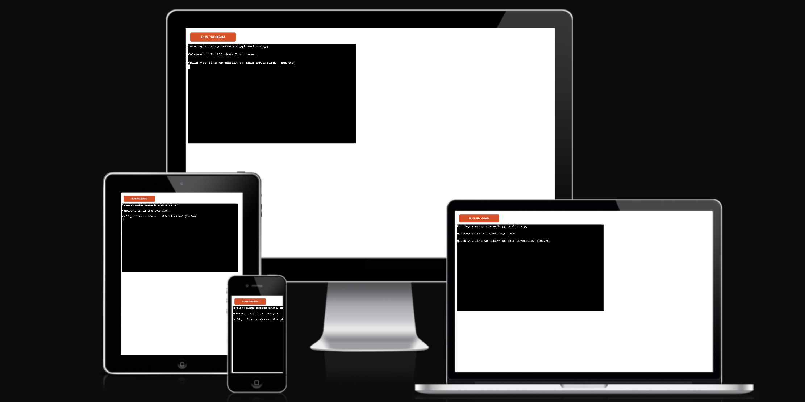
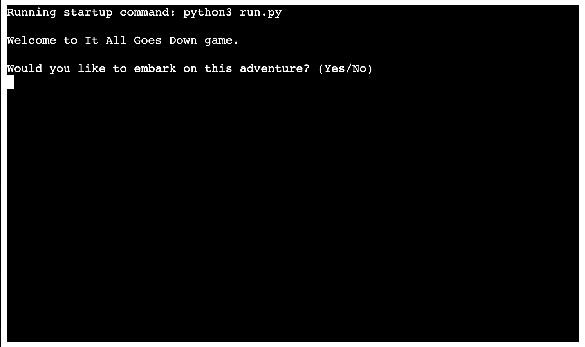
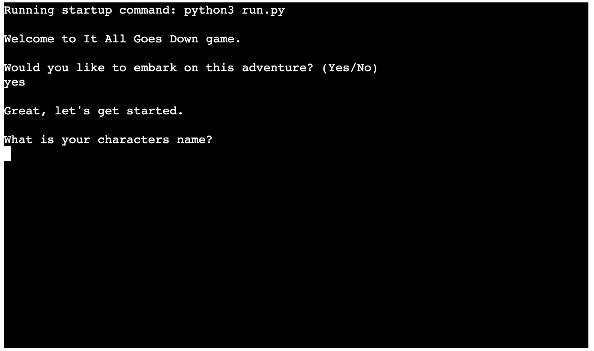
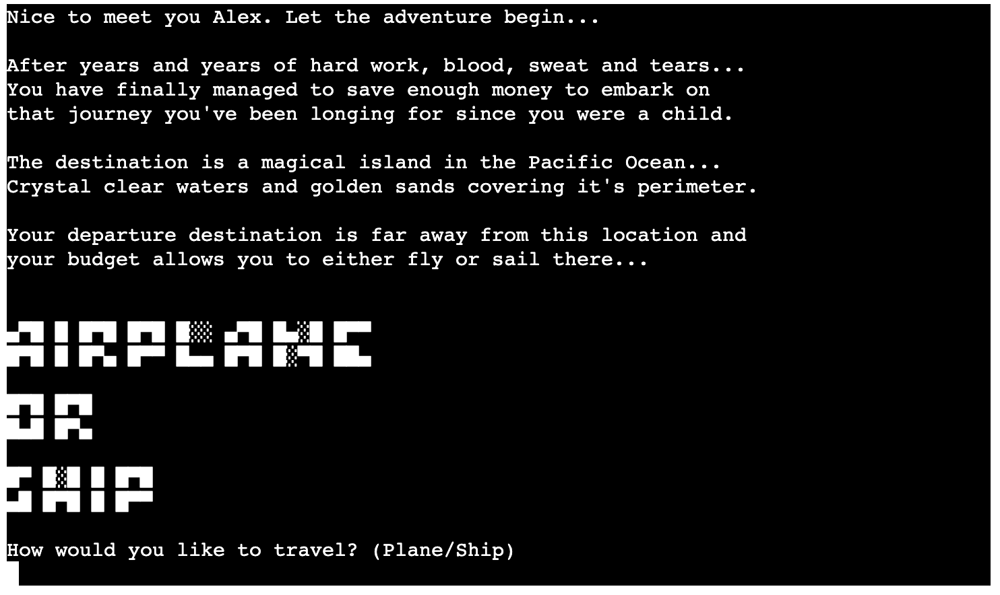

# IT ALL GOES DOWN ADVENTURE GAME

It All Goes Down is a command-line based adventure game that allows the user to choose which turn of events the story will take, depending on the decisions made when asked at various points throughout the story. The game runs on Heroku at the mock Terminal created by Code Institute.

The user goal is to try and make it out alive and overcome all challenges that have to be faced whilts playing the game. As the story unfolds the player is asked to make various decisions, those need to be made wisely since some decision are fatal and lead to a game over.

The live site can be found [here](https://it-all-goes-down-530830bd039b.herokuapp.com/)

## **Features**
### *Existing Features*

- __Landing Page__
    - The landing page welcomes the user asking them if they would like to play the game or not.
    - If the user types in "Yes" then the game starts.
    - If the user types in "No" then a goodbye message appears and the game ends.

- __Choose a Name Screen__
    - As soon as the game begins the user is being asked to input their name.

- __Transportation Decision__
    - Once a name is type in the story begins to unfold.
    - This is the first decision making stop of the game.
    - The user is being asked to choose which means of transport they would like to travel with.

- __Win or Lose Screen__

- __Exit Screen__

### *Potential Future Features*

## **Mockup**

## **Testing**

### *Validator Testing*

### *Fixed Bugs* 

### *Unfixed Bugs*
- Not applicable.

## **Creating GitHub Repository**
-  Creating a repository on Github.com:
    - Click on the Repositories tab.
    - On the top right-hand corner there is a green button that says "New", click on that.
    - Give the new repository a name, "it-all-goes-down-game" in this case.
    - Ensure the repository is public by clicking on the Public button under the Description field.
    - Click on the Add README file in order to have this file included automatically.
    - Lastly, at the bottom right-hand corner click on "Create repository".
    - The new repository should be now available on the repositories tab on GitHub.

- Deploying the the game to Heroku:
    -
    -

## **Deployment on Heroku** 

    
## **Credits**
### *Content*

### *Media* 

