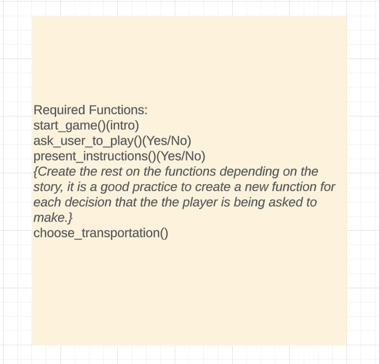
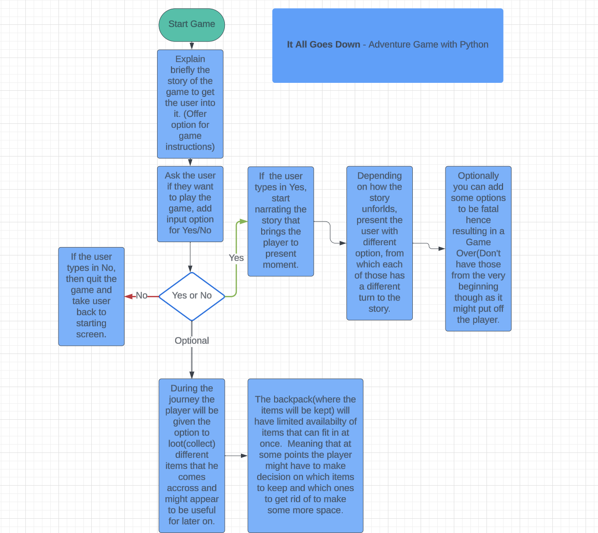
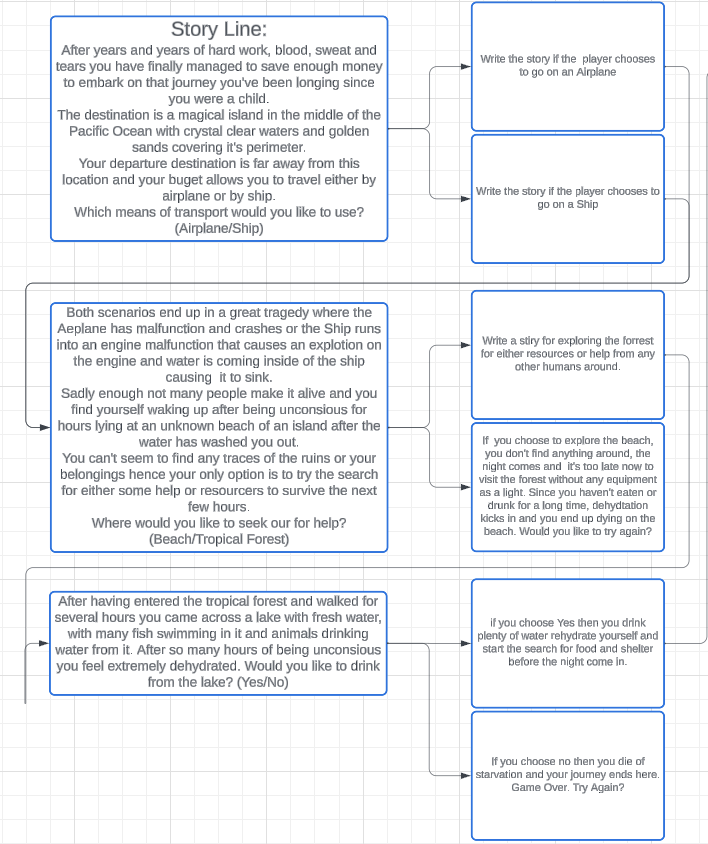
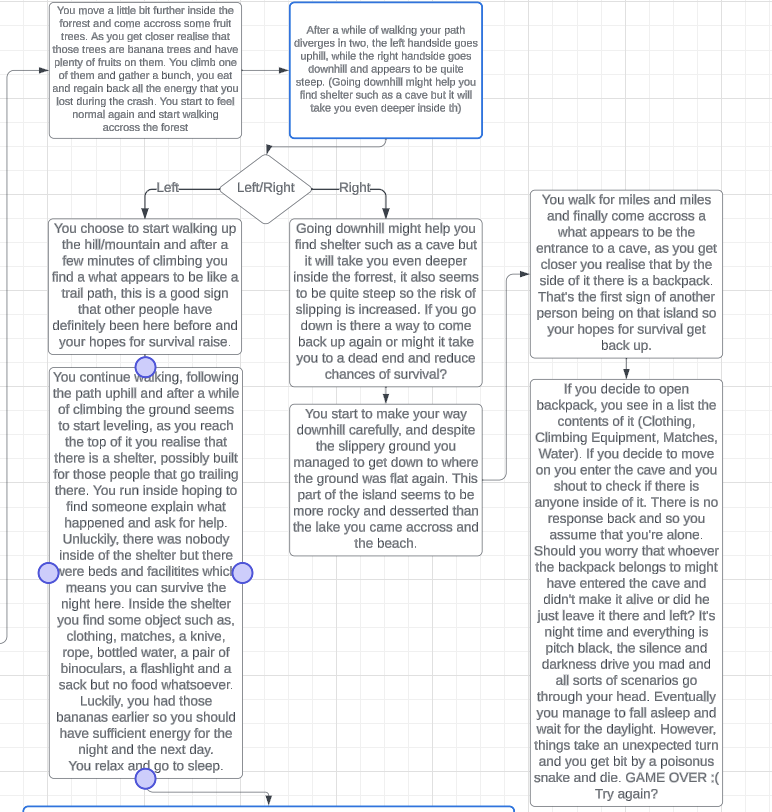
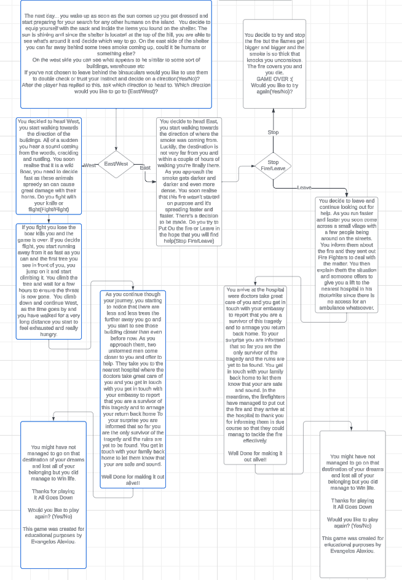
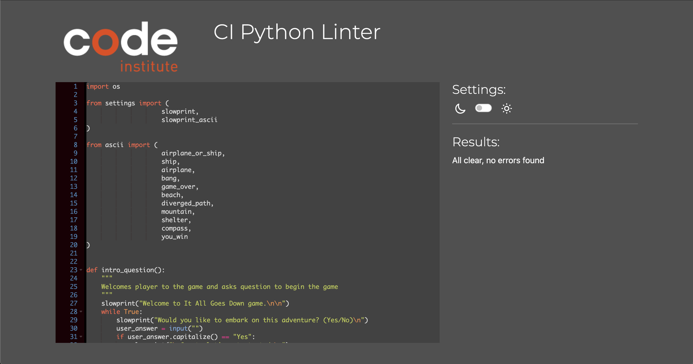
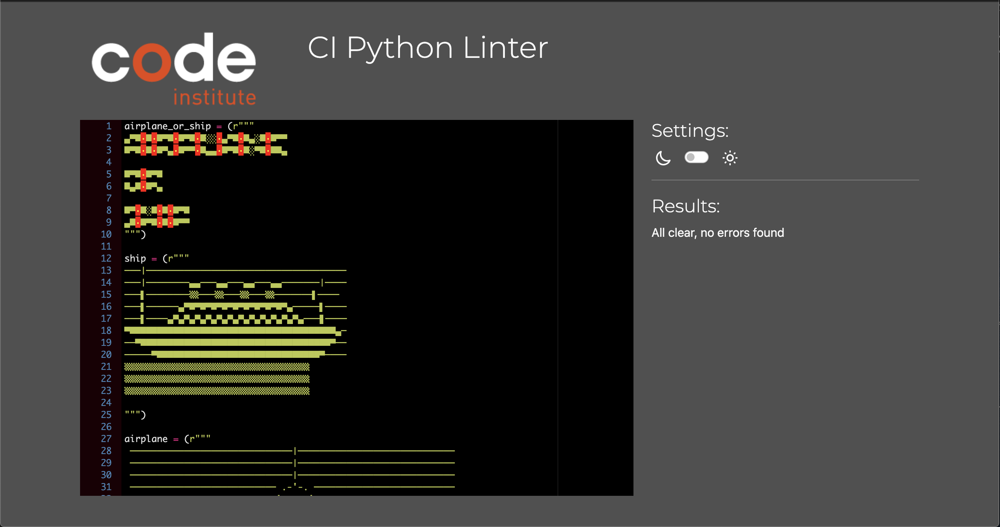
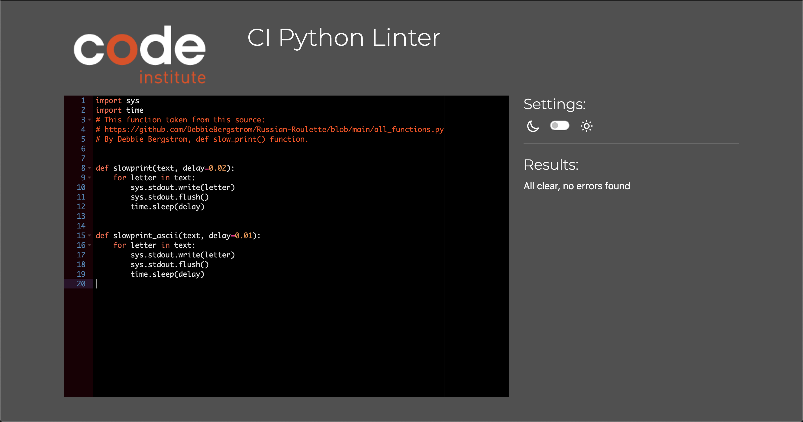

# IT ALL GOES DOWN ADVENTURE GAME

It All Goes Down is a command-line based adventure game that allows the user to choose which turn of events the story will take, depending on the decisions made when asked at various points throughout the story. The game runs on Heroku at the mock Terminal created by Code Institute.

The user goal is to try and make it out alive and overcome all challenges that have to be faced whilts playing the game. As the story unfolds the player is asked to make various decisions, those need to be made wisely since some decision are fatal and lead to a game over.

The live site can be found [here](https://it-all-goes-down-530830bd039b.herokuapp.com/)

## **Features**
### *Existing Features*

- __Landing Page__
    - The landing page welcomes the user asking them if they would like to play the game or not.
    - If the user types in "Yes" then the game starts.
    - If the user types in "No" then a goodbye message appears and the game ends.

- __Choose a Name Screen__
    - As soon as the game begins the user is being asked to input their name.

- __Transportation Decision__
    - Once a name is type in the story begins to unfold.
    - This is the first decision making stop of the game.
    - The user is being asked to choose which means of transport they would like to travel with.

- __Stay or Jump Decision__
    - Both the ship and the plane path end up in the same outcome.
    - However, the ship paths offers the player with another moment of a necessity to make a decision.
    - Jump from the sinking ship or wait for guidance from the crew.

- __Beach or Explore Decision__
    - The next decision after which means of transport to choose, 
    is whethere to stay at the beach or explore the forest for resources?
    - Depending on the games decision the story unfolds differently.

- __Drink From Lake__
    - Depending on which decision the user has made, the story eventually come to that point in which the user finds a lake.
    - Whether they decide to drink or not the story takes different turns.

- __Uphill Or Downhill__
    - The next decision the player comes accross is when the path after a while of walking splits in two opposite directions.
    - The player is being asked whether they want to go uphill or downhill.

- __West Or East__
    - Depending upon the previous decision the game at some point brings the player in need of making a decision.
    - Head West depending on what you can see or East.

- __Fight Or Flight__
    - Heading west leads to a life threatening situation and immediate danger.
    - It's up to the player to decide whether to fight or flight for their life.

- __Stop Or Help__
    - Heading east also leads to another life threatening scenario.
    - Again, it's the players decision whether to try and put out the fire and try and seek out for help.

- __Win Screen__
    - If you manage to make it out alive and your decision making for survival was effective then you come accross this screen.
    - It also let's the user decide whether to play again or exit.

- __Game Over__
    - If the wrong survival decisions have been made the user ends up on this screen.
    - It also let's the user decide whether to play again or exit.

### *Potential Future Features*
- Add more twists and turns to the story.
- Offer more decision making to the user.
- Add difficulty modes, and depending on user choice make the story harder or easier to win.
- Implement the ability of being able to loot items and have limited storage depending on bag size.
- Implement ability to add or remove items depending on needs.
- Design the terminal even more.
- Design CSS and add custom game background.

## **Mockup**
- The planning before writing any code had been done using [Lucidcharts](https://www.lucidchart.com/pages/landing?utm_source=google&utm_medium=cpc&utm_campaign=_chart_en_tier1_mixed_search_brand_exact_&km_CPC_CampaignId=1490375427&km_CPC_AdGroupID=55688909257&km_CPC_Keyword=lucidchart&km_CPC_MatchType=e&km_CPC_ExtensionID=&km_CPC_Network=g&km_CPC_AdPosition=&km_CPC_Creative=354596043016&km_CPC_TargetID=kwd-33511936169&km_CPC_Country=9046553&km_CPC_Device=c&km_CPC_placement=&km_CPC_target=&gad_source=1&gclid=CjwKCAiAuNGuBhAkEiwAGId4ak_DnJqkIQGh8_5ODViJ07z6jzUZbNnUYZEso-G56pdgrzHKGAynIRoCfnsQAvD_BwE).

- The planning was split in three different sections:
    - The functions map.
        
    
    - The game workflow.
        
    
    - The storyline.
        

        

        

## **Testing**

- All questions have been thoroughly tested for invalid or empty input.
- All of them functioned as they should and only continued to run the game when either of the desired inputs was typed in.
- Tested on Macbook Pro 13" on Google Chrome, game was functioning as expected.
- Tested on ASUS Zenbook 13" on Google Chrome, the game was functioning as expected on that laptop too.

### *Validator Testing*

- Run.py file passed through PEP8 linter without any errors.

- Ascii.py file passed through PEP8 linter without any errors.

- Settings.py file passed through PEP8 linter without any errors.

 
### *Unfixed Bugs*
- Not applicable.

## **Creating GitHub Repository**
-  Creating a repository on Github.com:
    - Click on the Repositories tab.
    - On the top right-hand corner there is a green button that says "New", click on that.
    - Give the new repository a name, "it-all-goes-down-game" in this case.
    - Ensure the repository is public by clicking on the Public button under the Description field.
    - Click on the Add README file in order to have this file included automatically.
    - Lastly, at the bottom right-hand corner click on "Create repository".
    - The new repository should be now available on the repositories tab on GitHub.

- Deploying the the game to Heroku:
    -
    -

## **Deployment on Heroku** 

    
## **Credits**
### *Content*

### *Media* 

